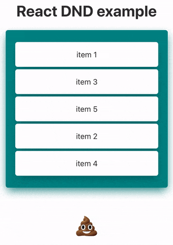

# React DND example

This is a simple test of the react-dnd library. Item.js file includes all of drag-and-drop functionality. Parent component must be wrapped by DndProvider.

For more info check the official documentation: [https://react-dnd.github.io](https://react-dnd.github.io/react-dnd/about)

**demo:**

